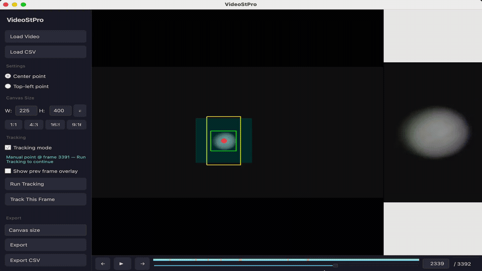

## Video Stabilizer Pro

This is a minimal requirements, purely Python based video stabilizer program. I created this to produce "consumer" grade astro photography videos out of my very amateur attempts at recording Jupiter from my iPhone 13 Pro.

Below is a short UI demo ([full video with audio](UI%20Demo.mp4)):



---

## What it does

- Draw a tracking box on any frame — the engine locks onto that region and follows it across the whole video
- Auto-tracking runs in one pass and stops if it loses confidence, letting you fix and resume
- Manual point overrides and single-frame tracking for precise corrections
- Export a stabilized crop following the tracked point, or export the full frame with a warp applied to lock the subject in place
- Tracking data saves and loads as CSV so you can iterate across sessions
- Builds an MJPEG proxy on first open so seeking is always frame-accurate (original is preserved for export)
- **Load Image Sequence** — folder of DNG/TIFF stills (e.g. PiCamera `*.raw.dng`); decodes once to a cached intermediate, tracks on RGB, exports stabilized **RGB TIFF** and/or **Bayer TIFF** (integer-pixel shifts on the raw mosaic)

---

## Requirements

```
pip install -r requirements.txt
```

`opencv-python`, `numpy`, `PyQt6`, `rawpy` (for DNG folders).

---

## Contributing

PRs are welcome — open an issue first if it's a significant change so we can align before you put in the work.

---

## License

MIT — free to use, modify, and build on. See [`LICENSE`](LICENSE).

---

Made by **jpaulmora** — follow along:
[YouTube](https://www.youtube.com/@jpaulmora) · [Instagram](https://www.instagram.com/jpaulmora) · [TikTok](https://www.tiktok.com/@jpaulmora)